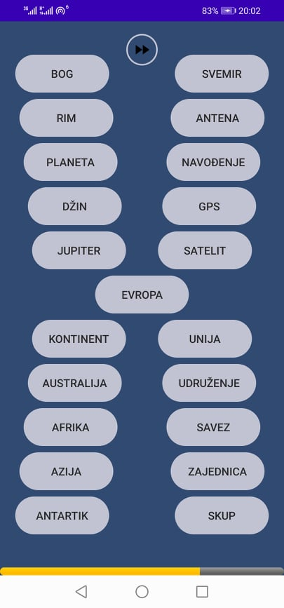

The goal of the game is to win as much points as you can within a time interval by solving logical problems.

[Lombok plugin for Android](https://projectlombok.org/setup/android#android-studio)

To run this on your own you're gonna need a database and a web server. Database model is provided in
file *WordAssociation.mwb* ([MySQL Workbench](https://www.mysql.com/products/workbench/)) from which
you can generate necessary SQL code. You can use scripts in the *service* folder, or create your own
endpoints which have to behave in the same way as given scripts.

Copy **config.properties.example** as **config.properties** and set appropriate values.

